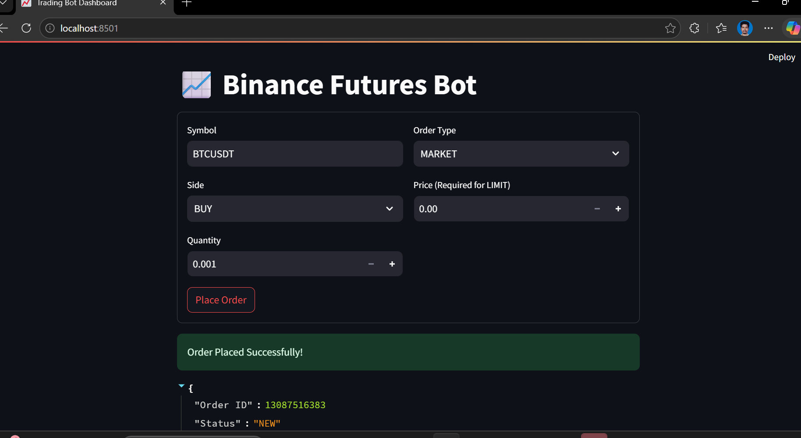

# Primetrade.ai - Binance Futures Trading Bot

A modular and decoupled Python application that interacts with the **Binance Futures Testnet (USDT-M)** to place MARKET and LIMIT orders via CLI and a lightweight UI.

---

## 📁 Directory Structure

```
trading_bot/
│
├── bot/
│   ├── __init__.py
│   ├── client.py         # Binance client wrapper
│   ├── orders.py         # Order placement logic
│   ├── validators.py     # Input validation
│   └── logging_config.py # Logging setup
│
├── cli.py                # CLI entry point
├── ui.py                 # Bonus: Streamlit UI
├── requirements.txt
├── .env                  # API keys (DO NOT COMMIT)
└── README.md
```

---

## 🧠 Architecture

This project follows a **clean separation of concerns**:

### Core Logic (`bot/`)

* `client.py` → Handles Binance connection
* `orders.py` → Order execution logic
* `validators.py` → Input validation
* `logging_config.py` → Logging setup

### Presentation Layer

* `cli.py` → Command Line Interface
* `ui.py` → Streamlit-based UI (Bonus)

This ensures **reusability, testability, and maintainability**.

---

## ⚙️ Setup Instructions

### 1. Clone / Extract the Repository

```bash
git clone https://github.com/Nishanthan15me104/trading_bot
cd trading_bot
```

---

### 2. Create & Activate Virtual Environment (PowerShell)

```bash
python -m venv .venv
.\.venv\Scripts\Activate.ps1
```

---

### 3. Install Dependencies

```bash
python -m pip install --upgrade pip
pip install -r requirements.txt
```

---

### 4. Configure Environment Variables

Create a `.env` file in the root directory: ensure u have key an secret

```
BINANCE_API_KEY=your_api_key_here
BINANCE_API_SECRET=your_api_secret_here
```


---

## 🚀 How to Run

### 1. Command Line Interface (CLI)

#### ▶ MARKET Order

```bash
python cli.py --symbol BTCUSDT --side BUY --type MARKET --quantity 0.005
```

#### ▶ LIMIT Order

```bash
python cli.py --symbol ETHUSDT --side SELL --type LIMIT --quantity 0.05 --price 3500
```

---

### 2. Streamlit UI (Bonus)

```bash
streamlit run ui.py
```

---

## 📊 Output Example

The CLI provides:

* Order request summary
* Order response:

  * orderId
  * status
  * executedQty
  * avgPrice
* Success / failure message

### sample :
```
 PS C:\Documents\clone2\trading_bot> python cli.py --symbol BTCUSDT --side BUY --type MARKET --quantity 0.005

--- Order Request Summary ---
Symbol:   BTCUSDT
Side:     BUY
Type:     MARKET
Quantity: 0.005
-----------------------------

SUCCESS: Order Placed Successfully!
Order ID:     13087510635
Status:       NEW
Executed Qty: 0.0000
Avg Price:    0.00

(.venv) PS C:\Documents\clone2\trading_bot> python cli.py --symbol ETHUSDT --side SELL --type LIMIT --quantity 0.05 --price 3500

--- Order Request Summary ---
Symbol:   ETHUSDT
Side:     SELL
Type:     LIMIT
Quantity: 0.05
Price:    3500.0
-----------------------------

SUCCESS: Order Placed Successfully!
Order ID:     8671075423
Status:       NEW
Executed Qty: 0.000
Avg Price:    0.00

(.venv) PS C:\Documents\clone2\trading_bot> 
```

---


## 📝 Logging

* Logs are stored in:

  ```
  bot.log
  ```

* Includes:

  * API connection status
  * Order requests
  * Order responses
  * Errors (API / Network / Validation)

---

## ⚠️ Challenges & Fixes

### 1. recvWindow Error (Time Sync Issue)

* Cause: Local system time mismatch with Binance server
* Fix: Synced server time using timestamp offset

---

### 2. UnicodeEncodeError in Logging

* Cause: Default encoding issues in Windows
* Fix: Forced UTF-8 encoding in logging handler
* Cause:The recvWindow Error (Time Sync) * Fix:Updated bot/client.py to tell the library to automatically adjust for this time difference.


---

## 📈 Improvements (Future Scope)

* Replace software time sync with NTP/PTP
* Add advanced order types (Stop-Limit, OCO)
* Add retry mechanism for failed API calls
* Add unit tests
* Dockerize the application

---

## ✅ Features Summary

* ✔ MARKET & LIMIT order support
* ✔ BUY / SELL support
* ✔ CLI-based interaction
* ✔ Input validation
* ✔ Structured modular code
* ✔ Logging with error tracking
* ✔ Exception handling (API + Network)
* ✔ Streamlit UI (Bonus)

---

## 📌 Notes / Assumptions

* Uses Binance Futures Testnet (USDT-M)
* Requires valid API credentials
* Orders may remain in NEW state if not matched (expected behavior)


## 🙌 Author

Developed as part of the Primetrade.ai hiring assignment.

